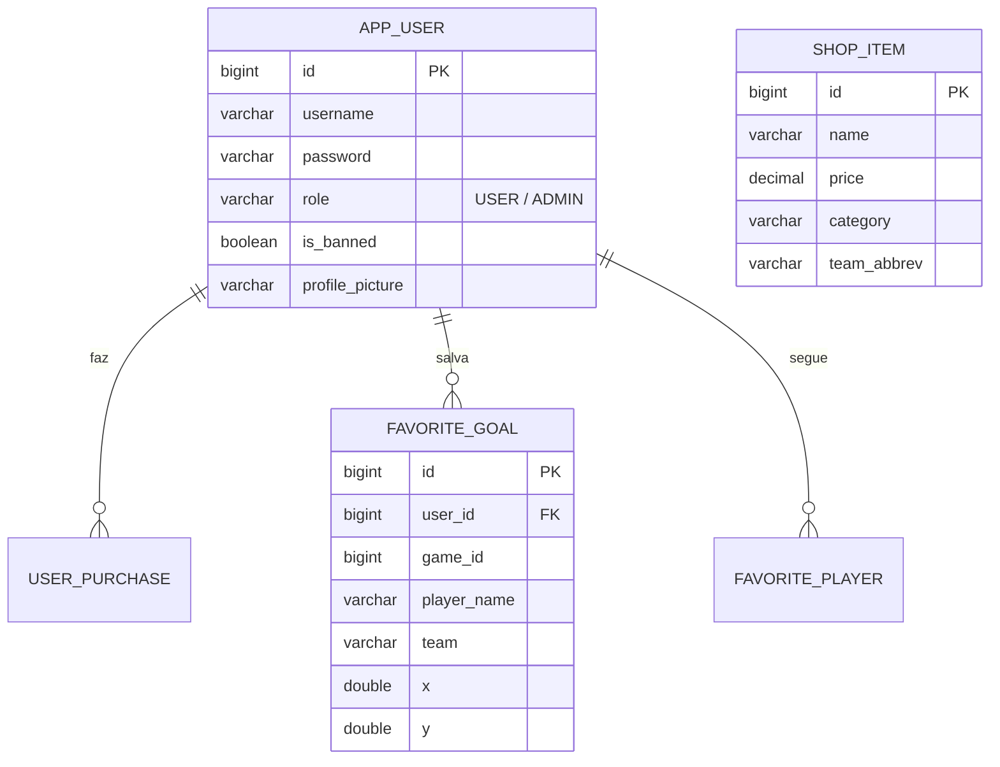

# 🏒 NHL Global Shop & Puck Tracker (Spring Boot + React)

Bem-vindo ao projeto **NHL Spring App**! Esta é uma aplicação full-stack robusta desenhada para fãs da NHL, que evoluiu de uma loja específica do Toronto Maple Leafs para uma **plataforma global com 32 times**, incluindo um Rastreador de Discos de hóquei em tempo real.

O sistema é um modelo híbrido poderoso que utiliza **Server-Side Rendering (Thymeleaf)** para o E-commerce, aliado a um **Single Page Application (React/Vite)** altamente interativo para o mapeamento e estatísticas dos gols.

---

## 🏛️ Resumo da Arquitetura e Integração

### 1. O "Endpoint Próprio" do React no Spring Boot
Para o **Puck Tracker**, criamos um app separado (`puck-tracker-react`). Ao ser compilado (`npm run build`), o Vite empacota tudo num arquivo `index.html` estático. Nós movemos esses arquivos para a pasta `/static/estatisticas/` do Spring.

No controlador Java, nós apenas dizemos ao servidor para não procurar um template dinâmico, mas sim servir a aplicação construída:
```java
@GetMapping("/estatisticas")
public String puckTracker() {
    return "forward:/estatisticas/index.html"; // Serve o React gerado!
}
```

### 2. Comunicação via APIs REST
O React não consome HTML do backend, ele consome dados via **APIs REST (JSON)**, que criamos usando a anotação `@RestController`:
- `GET /api/auth/me`: Devolve um JSON com `id`, `username` e `profilePicture` do usuário autenticado no Spring Security.
- `POST /api/favorites/goals`: O React envia as coordenadas (x,y) de um gol da NHL e o Spring salva as informações no banco de dados.

### 3. Sistema de Admin e Banimento Automático
A segurança é gerenciada via **Spring Security**. Temos o controle de roles (`USER`, `ADMIN`) e bloqueio automático (`is_banned`).
Quando um usuário banido tenta logar, o `CustomUserDetailsService` intercepta e lança uma `DisabledException`, impedindo o acesso à plataforma na mesma hora. O banimento é feito num painel exclusivo para o `ADMIN` via método POST que inverte o valor no banco.

---

## 👨‍🏫 Requisitos Acadêmicos (SQL Puro / JDBC)
Este projeto cumpre exigências de persistência manual em áreas críticas, evitando que o Hibernate faça tudo automaticamente, provando o domínio em **SQL Puro (JDBC)**:

1. **Filtros e Busca de Produtos:**
   - As consultas na loja principal não usam o JPA Repository. Elas são feitas diretamente via `JdbcTemplate`.
   - **Localização:** `ShopItemDAO.java` implementa `SELECT` dinâmicos com `LIKE` e injeção de parâmetros seguros (Prepared Statements).
2. **Cadastro Manual de Usuário:**
   - O registro (`AppUserDAO.java`) executa um `INSERT INTO app_users` puramente via SQL para controle absoluto da transação de criação.

---

## 📊 Fluxogramas

### Arquitetura Web & REST

```mermaid
graph TD
    User((🧑 Usuário))

    subgraph "Navegador Web"
        Site["🌐 Loja e Perfil (Thymeleaf)"]
        React["⚛️ Puck Tracker (SPA React)"]
    end

    subgraph "Spring Boot Server"
        Controller["🚦 NhlController (HTML)"]
        RestController["🔌 REST APIs (JSON)"]
        Security["🛡️ Spring Security"]
        Services["⚙️ Service Layer"]
    end

    DB[("🐘 PostgreSQL")]

    User -->|Acessa E-commerce| Controller
    Controller -->|Gera HTML| Site
    
    User -->|Acessa /estatisticas| Controller
    Controller -->|Devolve index.html| React

    React -->|Requisições AJAX (fetch)| RestController
    
    Site -. "Validação" .-> Security
    RestController -. "Validação" .-> Security
    
    Security --> Services
    Services <-->|JPA / JDBC| DB
```

### Modelo Entidade-Relacionamento (Banco de Dados)



---

## 🛠️ Stack Tecnológica
- **Backend:** Spring Boot 3.3.4 (Java)
- **Banco de Dados:** PostgreSQL (Tabelas geradas dinamicamente via `schema.sql`)
- **Acesso a Dados:** JdbcTemplate (SQL Puro) & Spring Data JPA (Hibernate)
- **Frontend SPA:** React 18, TypeScript, Vite
- **Frontend SSR:** Thymeleaf, CSS3, JavaScript Vanilla
- **Segurança:** Spring Security, BCrypt, Variáveis de Ambiente (`EMAIL_PASSWORD`)

## 📦 Como Iniciar o Projeto

1. Certifique-se de que o **PostgreSQL** está rodando em `localhost:5432` com o banco `nhldb` vazio.
2. Nas suas configurações de ambiente do Windows (ou IDE), adicione a variável `EMAIL_PASSWORD` com a senha do serviço de e-mail.
3. Para compilar o React:
   ```bash
   cd puck-tracker-react
   npm install
   npm run build
   ```
4. Para rodar o servidor Java:
   ```bash
   cd nhl-spring-app
   ./mvnw spring-boot:run
   ```
5. Acesse: `http://localhost:8081`
